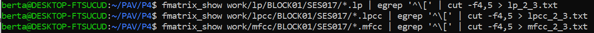
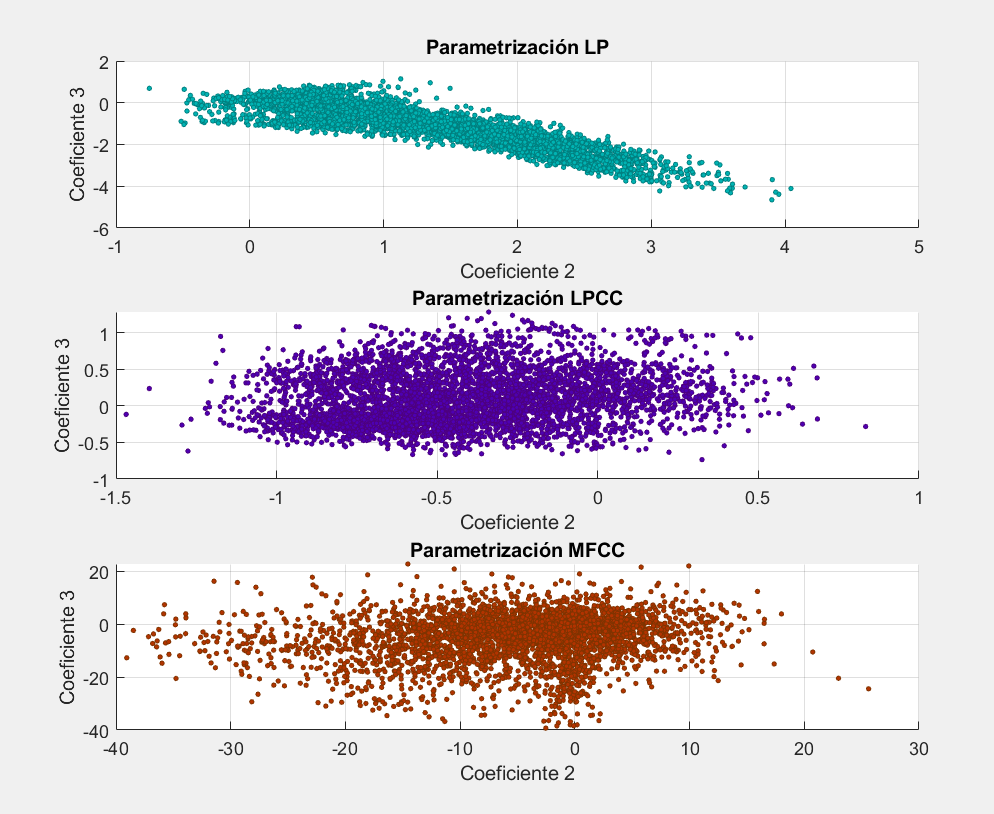
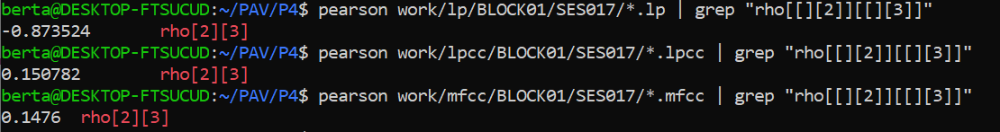

PAV - P4: reconocimiento y verificación del locutor
===================================================

Obtenga su copia del repositorio de la práctica accediendo a [Práctica 4](https://github.com/albino-pav/P4)
y pulsando sobre el botón `Fork` situado en la esquina superior derecha. A continuación, siga las
instrucciones de la [Práctica 2](https://github.com/albino-pav/P2) para crear una rama con el apellido de
los integrantes del grupo de prácticas, dar de alta al resto de integrantes como colaboradores del proyecto
y crear la copias locales del repositorio.

También debe descomprimir, en el directorio `PAV/P4`, el fichero [db_8mu.tgz](https://atenea.upc.edu/mod/resource/view.php?id=3654387?forcedownload=1)
con la base de datos oral que se utilizará en la parte experimental de la práctica.

Como entrega deberá realizar un *pull request* con el contenido de su copia del repositorio. Recuerde
que los ficheros entregados deberán estar en condiciones de ser ejecutados con sólo ejecutar:

~~~~~~~~~~~~~~~~~~~~~~~~~~~~~~~~~~~~~~~~~~~~~~~~~~~~~.sh
  make release
  run_spkid mfcc train test classerr verify verifyerr
~~~~~~~~~~~~~~~~~~~~~~~~~~~~~~~~~~~~~~~~~~~~~~~~~~~~~

Recuerde que, además de los trabajos indicados en esta parte básica, también deberá realizar un proyecto
de ampliación, del cual deberá subir una memoria explicativa a Atenea y los ficheros correspondientes al
repositorio de la práctica.

A modo de memoria de la parte básica, complete, en este mismo documento y usando el formato *markdown*, los
ejercicios indicados.

## Ejercicios.

### SPTK, Sox y los scripts de extracción de características.

- Analice el script `wav2lp.sh` y explique la misión de los distintos comandos involucrados en el *pipeline*
  principal (`sox`, `$X2X`, `$FRAME`, `$WINDOW` y `$LPC`). Explique el significado de cada una de las 
  opciones empleadas y de sus valores.

Podemos encontrar la forma de usar el wav2slp.sh en el mismo script. 
Inicialmente necesitamos una señal wav de entrada y el script nos devuelve un archivo llamado output.lp. 


Posteriormente vemos la definición de aquellos parámetros que el usuario deberá introducir al invocar el script. Estos son el número de coeficiente de predicción lineal, el fichero de entrada y el fichero de salida. Una vez los haya introducido en ese orden, se guardarán en las respectivas variables. 


Una vez hecho lo anterior, pasamos a analizar los distintos comandos involucrados en el *pipeline* principal. 

  · _sox_ : Nos sirve para editar la señal de audoio. En uestra pipeline se le entrega el fichero de entrada con las siguientes opciones:

        * -t : Tipo de fichero de audio. Nosotros usamos raw.
        * -e: Indicamos la codificación que queremos aplicar al fichero, en nuestro caso "signed".
        * b: Número de bits, usamos 16 bits. 
        * -: Redirección del output, es decir la pipeline.

  · _$X2X_ : Se trata de un paquete de SPTK que permite convertir ficheros a distintos formatos.

        * +sf : Pasamos de un formato a otro. Es decir de s (short - 2 bytes) a f (float - 4 bytes). 

  · _$FRAME_ : Sirve para segmentar la señal de entrada en disintas tramas con un determinado desplazamiento.

        * -l : Número de muestras de cada trama. Como se puede ver usamos 240 muestras, lo que equivale a 30 ms (fm = 8000 Hz). 
        * -p : Número de muestras de desplazamiento, usamos 80 muestras lo que equivale a 10 ms de desplazamiento entre ventanas.

  · _$WINDOW_ : Con este comando se le aplica a cada trama una ventana, que por defecto se usa la Blackman.

        * -l : Tamaño de la ventana de entrada, es decir las 240 muestras de cada trama, configurado previamente.
        * -L : Tamaño de la ventana de salida, mantenemos las 240 muestras.

  · _$LPC_ : Se usa para calcular los coeficientes LPC de cada trama enventanada.

        * -l : Tamaño de la ventana, en nuestro caso 240 muestras.
        * -m : Número de coeficientes LPC que queremos, lo determinamos en base a su orden 


        
- Explique el procedimiento seguido para obtener un fichero de formato *fmatrix* a partir de los ficheros de
  salida de SPTK (líneas 45 a 51 del script `wav2lp.sh`).

Para obtener el fichero de formato *fmatrix* necesitamos saber el número de filas y columnas que de la matriz. Para obtener el número de columnas solo necesitamos saber el orden de predicción y sumarle 1, debido a que el primer valor se corresponde a la ganancia y esta no está incluida en los coeficientes LPC. 

Por otro lado queremos obtener el número de filas. Para lograrlo usaremos el comando perl. Inicialmente tenemos un conjunto de floats de 4 bytes, para poder realizar el cálculo hacemos una transformación y los pasamos a ASCII. Por lo que se genera un fichero con los valores ASCII, uno en cada fila. A través del comando "wc -l" obtenemos el número de filas. 

  * ¿Por qué es más conveniente el formato *fmatrix* que el SPTK?

Este formato nos permite tener un mayor orden de los datos, de forma que tenemos las señales ordenadas y caracterizadas por tramas y coeficientes. Entonces en cada fila hay una trama de la señal y cada columna es un coeficiente con el que hemos parametrizado la trama. Cabe destacar que con las matrices podemos seleccionar las filas y columnas que nos interesen fácilmente a través de usar "cut". 


- Escriba el *pipeline* principal usado para calcular los coeficientes cepstrales de predicción lineal
  (LPCC) en su fichero <code>scripts/wav2lpcc.sh</code>:

  

Tomando como referencia el fichero wav2lp.sh realizamos el scrpit wav2lpcc.sh. El comando principal de extracción de características sigue la misma estructura que en el wav2lp.sh, pero teniendo en mente que para obtener estos coeficientes cepstrales debemos antes calcular los LPC. Es por esto que primero se hace uso del comando $LPC y, posteriormente del comando $LPCC. 

- Escriba el *pipeline* principal usado para calcular los coeficientes cepstrales en escala Mel (MFCC) en su
  fichero <code>scripts/wav2mfcc.sh</code>:

  

Usamos de nuevo la referencia del fichero wav2lp.sh. Ahora utilitzamos el comando $MFCC, donde le indicamos el número de coeficientes además de qué banco de filtros queremos usar. 

### Extracción de características.

- Inserte una imagen mostrando la dependencia entre los coeficientes 2 y 3 de las tres parametrizaciones
  para todas las señales de un locutor.
  
  + Indique **todas** las órdenes necesarias para obtener las gráficas a partir de las señales 
    parametrizadas.
    En primer lugar, parametrizamos en lp, lpcc y mfcc ejecutando run_spkid:

    <code>FEAT=lp run_spkid lp</code>

    <code>FEAT=lpcc run_spkid lpcc</code>

    <code>FEAT=mfcc run_spkid mfcc</code>

    A continuación, hemos convertimos a texto los coeficientes 2 y 3 para cada una de las parametrizaciones:

  

    Finalmente, para representar las gráficas a partir de los ficheros de texto, hemos ejecutado el fichero de matlab "graficas.m", cuyo código es el siguiente:

  ```c
    %LP
      datos_lp = load('lp_2_3.txt');
      coef_2_lp = datos_lp(:,1);
      coef_3_lp = datos_lp(:,2);
      sz=5;
    
      subplot(3,1,1);
      scatter(coef_2_lp, coef_3_lp, sz, 'filled', 'MarkerEdgeColor',[0 .5 .5],'MarkerFaceColor',[0 .7 .7],'LineWidth',0.5);
      title('Parametrización LP')
      xlabel('Coeficiente 2')
      ylabel('Coeficiente 3')
      grid on

    
      %LPCC
    
      datos_lpcc = load('lpcc_2_3.txt');
      coef_2_lpcc = datos_lpcc(:,1);
      coef_3_lpcc = datos_lpcc(:,2);
      sz=5;
    
      subplot(3,1,2);
      scatter(coef_2_lpcc, coef_3_lpcc, sz, 'filled','MarkerEdgeColor',[.3 0 .5],'MarkerFaceColor',[.3 0 .7],'LineWidth',0.5);
      title('Parametrización LPCC')
      xlabel('Coeficiente 2')
      ylabel('Coeficiente 3')
      grid on

      %MFCC
    
      datos_mfcc = load('mfcc_2_3.txt');
      coef_2_mfcc = datos_mfcc(:,1);
      coef_3_mfcc = datos_mfcc(:,2);
      sz=5;
    
      subplot(3,1,3);
      scatter(coef_2_mfcc, coef_3_mfcc, sz, 'filled', 'MarkerEdgeColor',[.5 .2 0],'MarkerFaceColor',[.7 .2 0],'LineWidth',0.5);
      title('Parametrización MFCC')
      xlabel('Coeficiente 2')
      ylabel('Coeficiente 3')
      grid on
     ```

    Hemos obtenido las siguientes graficas de la dependencia entre los coeficientes 2 y 3 de cada parametrización:
    

  + ¿Cuál de ellas le parece que contiene más información?

  Obtendremos la mayor información de aquella gráfica con los coeficientes más incorrelados, es decir, que el nivel de correlación entre coeficientes cercanos es lo que nos indica cuanta información nos da. En nuestro caso podemos observar que en el caso de LP, parece haber una correlación lineal entre los coeficientes, por lo que tenemos poca información. En cambio, en el caso de LPCC y MFCC, ambos tiene una distribución más dispersa, aunque se puede observar menos correlación entre coeficientes en el caso de MFCC.

- Usando el programa <code>pearson</code>, obtenga los coeficientes de correlación normalizada entre los
  parámetros 2 y 3 para un locutor, y rellene la tabla siguiente con los valores obtenidos.
  
  Ejecutamos el comando pearson para cada parametrización y obtenemos los coeficientes 2 y 3:

  


  |                        | LP      | LPCC   | MFCC |
  |------------------------|:-------:|:------:|:----:|
  | &rho;<sub>x</sub>[2,3] |-0.873524|0.150782|0.1476|
  
  + Compare los resultados de <code>pearson</code> con los obtenidos gráficamente.

  Los valores obtenidos para &rho;<sub>x</sub>[2,3] nos indican el nivel de correlación entre los coeficientes 2 y 3, siendo el más correlado aquel con un valor absoluto más cercano a 1. Como podemos observar, para LP obtenemos un valor absoluto más cercano a 1, por lo que aporta menos información, mientras que los valores de LPCC y MFCC son más cercanos a 0, por lo que los coeficientes son más incorrelados entre sí y por lo tanto aportan más información. Además, podemos observar que los coeficientes para MFCC son ligeramente más incorrelados que para LPCC, como ya hemos comentado en el apartado anterior. 
  Por lo tanto, los resultados de <code>pearson</code> obtenidos concuerdan con los obtenidos gráficamente.
  
- Según la teoría, ¿qué parámetros considera adecuados para el cálculo de los coeficientes LPCC y MFCC?

Según la teoría, para LPCC se suelen escoger entre 8 y 14 coeficientes, siendo suficiente 13 coeficientes. Para MFCC, se suelen escoger entre 13 coeficientes, y entre 24 y 40 filtros.

### Entrenamiento y visualización de los GMM.

Complete el código necesario para entrenar modelos GMM.

- Inserte una gráfica que muestre la función de densidad de probabilidad modelada por el GMM de un locutor
  para sus dos primeros coeficientes de MFCC.


Obtenemos el gráfico anterior usando:


- Inserte una gráfica que permita comparar los modelos y poblaciones de dos locutores distintos (la gŕafica
  de la página 20 del enunciado puede servirle de referencia del resultado deseado). Analice la capacidad
  del modelado GMM para diferenciar las señales de uno y otro.

Primero lo hacemos con el comando:


Y obtenemos la siguiente gráfica:


Posteriormente usamos un locutor distinto: 


Y tenemos estos resultados:


Se observa claramente que en la primera gráfica el locutor está mucho mejor modelado que en la segunda. Esto tiene sentido ya que el modelo GMM que corresponde al primer locutor se adapta mucho mejor a sus muestras que al usar un locutor distinto. Esto lo vemos en la mayor cantidad de muestras fuera de la región prevista.


### Reconocimiento del locutor.

Complete el código necesario para realizar reconociminto del locutor y optimice sus parámetros.

- Inserte una tabla con la tasa de error obtenida en el reconocimiento de los locutores de la base de datos
  SPEECON usando su mejor sistema de reconocimiento para los parámetros LP, LPCC y MFCC.

  Usando lp:


Usando lpcc:


Usando mfcc:


Tal y como se puede observar, hemos cometido algún error ya que usando MFCC los resultados deberían ser mucho mejores de los que hemos obtenido. 


    |                    | LP      | LPCC   | MFCC |
    |--------------------|:-------:|:------:|:----:|
    | Número de errores  |   58    |    2   |  99  |
    | Número total       |   785   |   785  |  785 |
    | Tasa de error (%)  |  7.39%  |  0.25% |12.61%|
 
### Verificación del locutor.

Complete el código necesario para realizar verificación del locutor y optimice sus parámetros.

- Inserte una tabla con el *score* obtenido con su mejor sistema de verificación del locutor en la tarea
  de verificación de SPEECON. La tabla debe incluir el umbral óptimo, el número de falsas alarmas y de
  pérdidas, y el score obtenido usando la parametrización que mejor resultado le hubiera dado en la tarea
  de reconocimiento.

LP:


LPCC:


MFCC:


 
### Test final

- Adjunte, en el repositorio de la práctica, los ficheros `class_test.log` y `verif_test.log` 
  correspondientes a la evaluación *ciega* final.

### Trabajo de ampliación.

- Recuerde enviar a Atenea un fichero en formato zip o tgz con la memoria (en formato PDF) con el trabajo 
  realizado como ampliación, así como los ficheros `class_ampl.log` y/o `verif_ampl.log`, obtenidos como 
  resultado del mismo.
